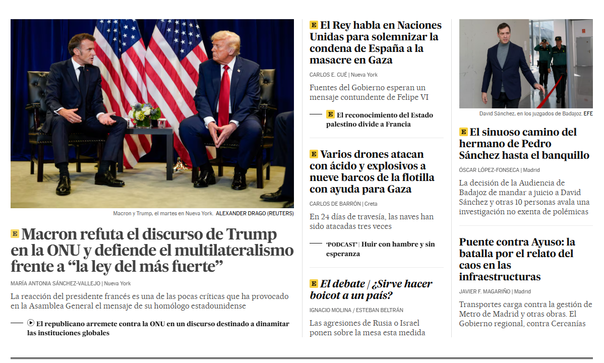
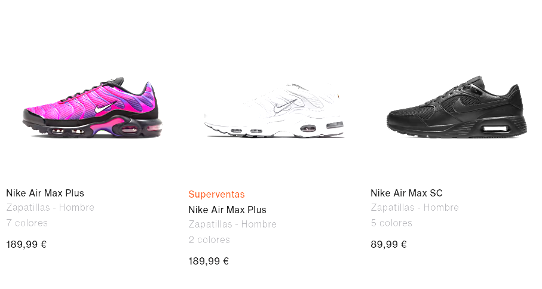

# Leyes de la Gestalt aplicadas a webs reales

| Ley                    | Explicación                                                                                                                                                                                                 | Ejemplo                                                                 |
|------------------------|-------------------------------------------------------------------------------------------------------------------------------------------------------------------------------------------------------------|-------------------------------------------------------------------------|
| Ley del Contraste      | Los elementos se perciben como distintos entre sí debido a sus características visuales, como el tamaño, color, forma o textura. En la imagen se da mayor tamaño a la noticia destacada.                | |
| Ley de Jerarquización  | Tendemos a organizar la información visual separando los elementos en figura principal (más atención) y fondo. En la imagen se destacan los botones de compra en amarillo sobre fondo blanco.           | |
| Ley de Birkhoff        | La estética visual se mide como relación entre orden y complejidad. Interfaces equilibradas entre estructura clara y riqueza visual generan experiencias agradables. Dropbox combina ilustraciones y estructura clara. | |
| Ley de Memoria         | Una forma se percibe mejor cuanto más veces ha sido vista antes. En la imagen se muestra una web reconocida donde los botones se recuerdan aunque cambie el diseño.                                     | |
| Ley del Cierre         | Los usuarios perciben formas incompletas como completas, rellenando mentalmente los huecos. El logo de WWF no tiene líneas completas pero se reconoce el oso panda fácilmente.                            | |
| Ley de la Continuidad  | Elementos alineados en una dirección continua se perciben como parte de un mismo grupo. En diseño web se usa para guiar la mirada del usuario y crear una experiencia fluida.                             |                  |
| Ley de la Proximidad   | Elementos cercanos se perciben como grupo. En diseño web se agrupa contenido similar para crear estructura visual. En la imagen, los bloques debajo de cada zapato muestran sus características.             | |
| Ley de la Simetría       | Percibimos los elementos como parte de un grupo si están organizados de forma simétrica. Esto se traduce en interfaces equilibradas, con elementos alineados y distribuidos de forma armoniosa.           | |
| Ley de la Semejanza      | Elementos similares en forma, color, tamaño o estilo tienden a percibirse como parte de un mismo grupo. En la imagen se presentan productos en tarjetas con el mismo tamaño, tipografía y estilo.          | |
| Ley del Movimiento Común | Elementos que se mueven en la misma dirección o velocidad se perciben como parte de un mismo grupo. En Spotify, al scrollear una lista, todas las canciones se mueven a la vez, creando sincronía visual. |                                    |
| Ley de Invariancia Topológica | Somos capaces de reconocer formas aunque estén deformadas, rotadas o cambiadas de tamaño, siempre que mantengan su estructura esencial. El logo de Nike se reconoce incluso distorsionado.         | |