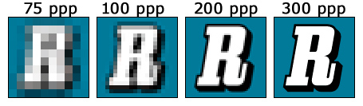

# Resolución 
  
*ppp -> puntos por pulgada*

---
La resolución de una imagen es la cantidad de detalle que esta posee, determinada por el número de píxeles que contiene: a mayor número de píxeles por unidad de superficie, mayor será la nitidez y definición de la imagen.

